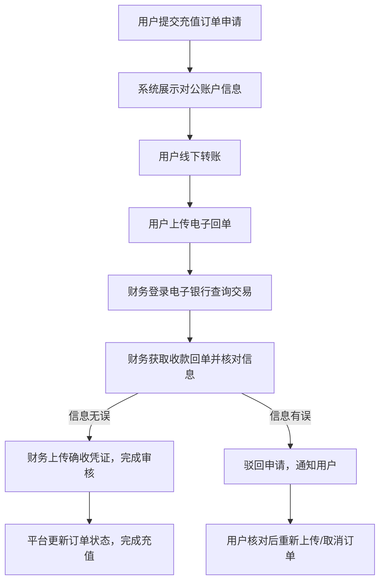
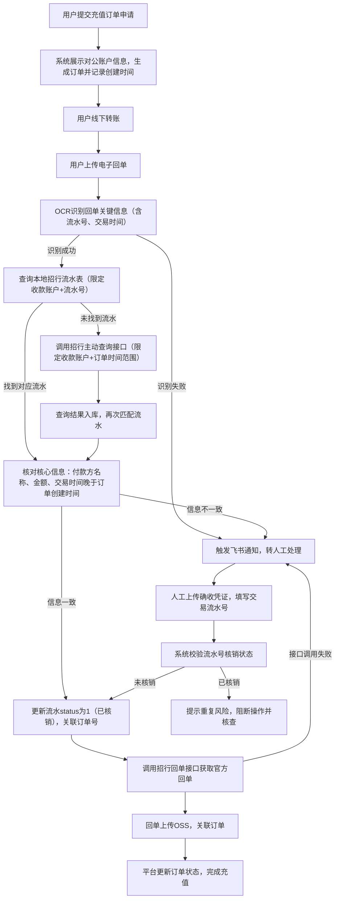
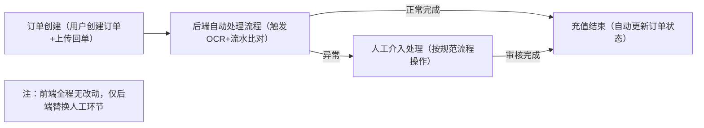

# 招行支付自动充值技术方案

# 一、方案背景

为满足公司业务支付对接需求，公司计划接入招商银行支付渠道。受限于招行接口功能限制，无法实现类似支付宝的常规对接模式（即创建订单后传递平台订单号，支付成功后通过回调携带该订单号关联平台订单），导致原有充值流程需依赖人工介入完成交易审核，不仅处理效率低下，还易因人为操作产生核对误差。

为提升充值业务处理效率、降低人工运营成本、规避人工审核误差，公司规划实现招行支付自动充值功能。通过OCR识别、流水信息比对、招行接口调用等后端技术手段，替代原有财务人工查询、审核环节，前端交互流程保持完全不变，仅优化后端处理链路，同时保留人工介入机制作为异常订单兜底方案，保障业务连续稳定运行。

# 二、原有人工充值流程

## 2.1 流程概述

原有招行支付充值流程完全依赖人工完成交易核验与审核，核心依赖财务人员通过电子银行查询交易明细、核对回单信息并完成确认，处理效率低且易产生误差。

## 2.2 详细流程步骤

1. 用户在呼波特平台提交充值订单申请，系统生成唯一订单，同步展示公司对公账户信息（含账户名、账号、开户行）；

2. 用户复制对公账户信息，通过线下渠道（网银、手机银行等）向该对公账户转账；

3. 用户完成转账后，在平台上传转账电子回单，提交审核申请；

4. 财务人员登录电子银行，查询公司对公账户的收款交易，获取对应收款电子回单；

5. 财务人员核对平台提交的电子回单与银行收款回单信息，重点校验转账金额、付款方企业名称、转账时间等关键项，确认无异议后，上传确收回单至平台，完成审核流程；

6. 平台接收财务审核通过的信息，更新订单状态为“充值完成”，为用户账户划转对应金额，充值流程结束。

## 2.3 流程痛点

- 效率低下：每笔订单需财务人员手动查询银行流水、核对信息、上传回单，处理周期长，无法满足用户快速到账需求；

- 人工成本高：需专人实时对接订单审核工作，占用核心财务人力，业务量增长时需同步追加人力，成本可控性差；

- 误差风险：人工核对易出现漏看、错看问题，可能导致订单审核错误，影响用户体验或引发资金安全风险；

- 业务瓶颈：人工处理能力有限，高峰期易出现订单堆积，影响业务正常开展。

# 三、自动充值方案

## 3.1 方案目标

本方案通过后端技术实现招行支付充值全流程自动化，替代原有财务人工查询、信息核对、回单上传等操作，构建“用户上传回单→后端系统自动核验→自动完成充值”的闭环链路，前端交互与原有流程完全一致，同时保留人工介入机制兜底异常订单，核心目标如下：

- 提升效率：自动核验流程处理时长控制在分钟级，大幅缩短充值到账时间；

- 降低成本：减少财务人工审核工作量，实现业务规模化扩张时人力成本不同步增长；

- 降低风险：通过系统精准比对信息，杜绝人工核对误差，保障资金与订单安全；

- 业务兼容：前端交互无任何改动，异常订单自动触发人工介入，兼顾效率与安全性。

## 3.2 核心技术依赖

- OCR识别技术：解析用户上传的电子回单，精准提取交易流水号、转账金额、付款方名称、转账时间等关键信息；

- 招行开放平台接口：通过回调、主动查询、回单获取接口实现交易明细获取、回单下载等操作；

- 本地流水表：存储招行交易明细，用于快速比对、重复核销控制，提供数据支撑；

- OSS存储服务：存储招行官方电子回单，用于订单关联与留存归档；

- 飞书通知接口：异常订单自动触发飞书告警，推送详情至负责人，启动人工处理。

## 3.3 详细流程设计

### 3.3.1 整体流程框架

自动充值流程以“用户上传回单→OCR识别→流水比对→回单获取→充值完成”为核心链路，后端替代人工审核，前端交互不变，异常订单自动转人工兜底，形成完整业务闭环。

### 3.3.2 分步流程说明

1. 订单创建与账户展示：用户提交充值订单，系统生成唯一订单号，关联订单金额、付款方信息，同步展示对公账户信息供用户转账；

2. 用户转账与回单上传：用户通过线下渠道完成转账，在平台上传电子回单，触发自动审核流程；

3. OCR识别提取信息：系统调用OCR接口解析回单，提取流水号、金额、付款方名称、交易时间等关键信息；识别失败则触发飞书通知，流转至人工处理；

4. 流水信息比对：系统通过OCR识别的流水号，结合收款账户查询本地流水表（查询已限定收款账户，无需额外校验）；未查询到则调用招行主动查询接口，按“订单创建时间范围+收款账户”检索并入库后重新匹配。匹配成功后校验三项核心信息：付款方名称与平台留存一致、交易金额与订单金额一致、交易时间晚于订单创建时间（规避时序异常）。校验通过后，更新流水表核销状态为1（已核销），关联订单号，避免重复使用；

5. 电子回单获取与存储：信息比对通过后，调用招行回单获取接口，传入流水号获取官方PDF回单，上传至OSS并将存储地址存入流水表；

6. 自动完成充值：系统更新订单状态为“充值完成”，划转对应资金至用户账户，生成成功日志，流程结束；

7. 异常处理：出现流水无匹配、信息不一致、OCR识别失败、接口异常等情况，自动触发飞书告警。人工处置时需上传确收凭证并手动填写流水号，系统校验流水号核销状态（未核销则更新状态并关联订单，已核销则提示风险并阻断），处置完毕后手动更新订单状态。

### 3.3.3 本地流水表设计（暂定）

本地流水表用于存储招行交易明细，支撑流水比对与重复核销控制，结合MySQL语法及业务需求，核心字段设计如下：

|字段名称|字段类型（MySQL）|是否主键|字段说明|
|---|---|---|---|
|id|BIGINT|是|主键ID（自增）|
|transSequenceIdn|VARCHAR(64)|否|交易流水号（招行返回，唯一标识）|
|payeeAccount|VARCHAR(32)|否|收款账户（公司对公账号）|
|transTime|DATETIME|否|交易时间（招行返回，精确到秒）|
|transAmount|DECIMAL(18,2)|否|交易金额（单位：元，匹配交易币种）|
|currencyNbr|VARCHAR(8)|否|交易币种（如：CNY-人民币）|
|payerName|VARCHAR(128)|否|付款方名称|
|status|TINYINT|否|核销状态（0：未核销，1：已核销），默认0|
|orderId|VARCHAR(64)|否|关联平台订单号（核销后填写）|
|receiptUrl|VARCHAR(256)|否|电子回单OSS存储地址|
|createdAt|BIGINT|否|创建时间（时间戳，gorm配置）|
|updatedAt|BIGINT|否|更新时间（核销、回单上传后更新）|
### 3.3.4 接口调用说明

方案依赖4类接口构建自动化链路，确保流程闭环与稳定运行，具体调用逻辑如下：

1. **招行回调接口**（https://openbiz.cmbchina.com/clouddc-document?bizkey=DCCT20230413170047667&subclass=1&treeID=100100326）：招行主动推送对公账户交易明细至公司预设接口，系统解析校验后同步至本地流水表，减少主动查询频次，提升比对效率；

2. **招行主动查询接口**（https://openbiz.cmbchina.com/clouddc-document?bizkey=DCCT20201214145038074&subclass=1&treeID=100101319）：本地流水表无匹配流水时，按“订单时间范围+收款账户”调用接口，获取明细入库后重新匹配，兜底补充流水信息；

3. **招行回单获取接口**（https://openbiz.cmbchina.com/clouddc-document?bizkey=DCCT20201214145038074&subclass=1&treeID=100101326）：流水比对通过后，传入流水号获取官方PDF回单，上传OSS并记录存储地址；

4. **飞书通知接口**：出现OCR识别失败、流水无匹配、信息不一致、接口异常等情况时，自动推送订单详情至负责人，启动人工处理。

### 3.3.5 流程兼容设计

方案通过后端优化替代人工，前端交互与原有流程完全一致，实现自动与人工流程无缝衔接，具体设计如下：

- **交互无感知**：前端维持订单提交、账户展示、回单上传等原有界面与操作，用户上传回单后，后端将“等待人工审核”替换为自动核验，用户无感知，不影响使用习惯；

- **订单智能分流**：正常订单全程自动化处理，异常订单自动触发飞书告警并流转至人工通道；人工需核对信息、上传确收凭证，且强制填写流水号，系统校验核销状态后才可继续，规避重复充值；

- **数据统一归档**：自动与人工处理的订单状态、审核记录、回单文件、异常原因等信息，统一存储至数据库，后台可追溯全量处理轨迹，满足对账与合规要求。

# 四、流程图

## 4.1 原有人工充值流程图

## 4.2 自动充值流程图

## 4.3 整体流程兼容示意图

# 五、风险控制与注意事项

## 5.1 核心风险控制

1. **重复核销风险**：通过流水表status字段管控，自动流程校验通过后更新为1；人工介入强制填写流水号，系统校验未核销方可继续，杜绝同一流水多订单复用，保障资金安全；

2. **时序异常风险**：自动校验“交易时间晚于订单创建时间”，规避交易早于订单生成的异常场景，确保订单与交易对应合理；

3. **接口调用风险**：招行接口配置重试机制（建议3次，间隔10秒），重试失败触发飞书通知转人工，避免流程卡顿；

4. **OCR识别精度风险**：设置识别精度阈值，低于阈值的回单直接转人工，同时优化OCR模型参数提升准确率；

5. **接口权限风险**：提前确认招行接口权限开通，密钥妥善保管并定期轮换，规避泄露风险；

## 5.2 关键注意事项

- 人工介入必须填写交易流水号，系统强制校验核销状态，已核销则阻断操作，从流程上规避重复充值（如两笔订单共用同一流水，前笔人工未核销导致后笔自动核销的场景）；

- 自动校验严格把控订单与交易时间先后顺序，仅交易时间更晚的记录可通过，排除时序异常数据；

- 人工处理异常订单后，需同步更新流水核销状态与订单关联关系，确保自动流程数据准确，保障闭环。

# 六、总结

本方案通过OCR识别、招行接口对接、本地流水表管理等后端技术，在前端交互完全不变的前提下，实现招行支付充值全流程自动化，替代原有人工审核环节。针对重复充值、时序异常两大核心风险，优化关键流程设计：人工介入强制填写流水号并校验核销状态，自动流程新增时间先后校验，有效解决人工流程效率低、成本高、风险大的痛点。方案以异常自动转人工机制兜底，搭配多重风险控制措施，兼顾业务效率与安全性，落地后用户操作无感知，仅后端实现效率升级，可为公司业务规模化扩张提供有力支撑。
> （注：文档部分内容可能由 AI 生成）